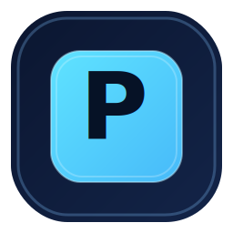
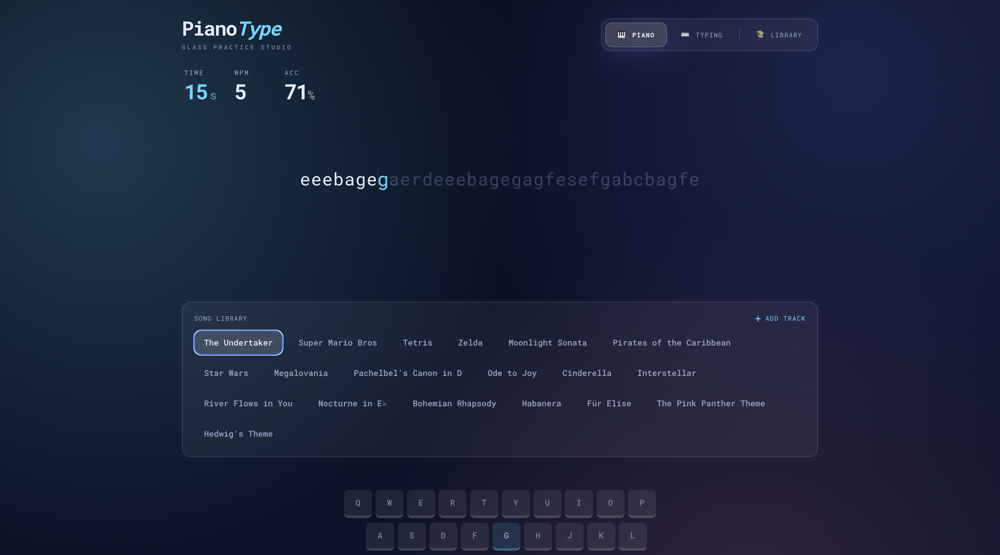
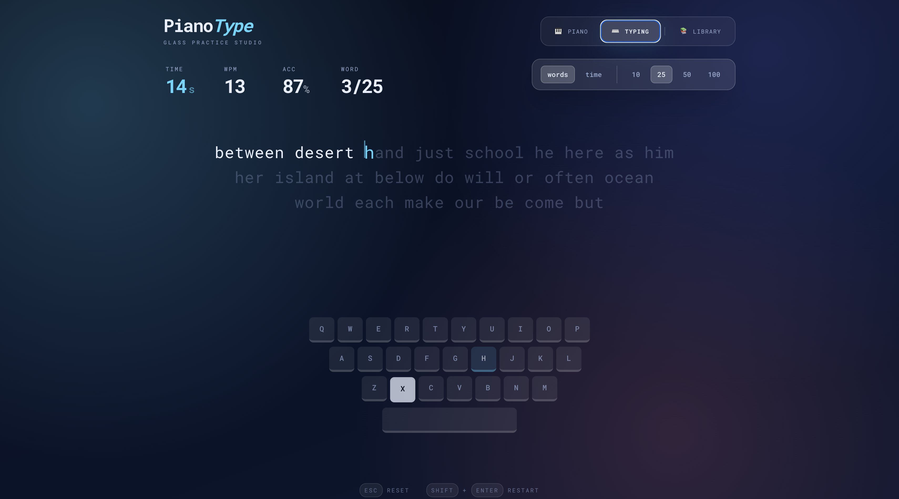

# PianoType

## What This Website Is For

PianoType is a typing trainer that mixes two experiences in one place:
- Piano-style key training where each correct key can trigger a mapped piano note.
- Typing test practice where you improve speed, accuracy, and word-flow consistency.

It is made for people who want typing practice to feel more interactive than a normal text test.

## Core Features

- Two modes:
- `Piano Mode`: play through mapped song sequences using keyboard input.
- `Typing Mode`: practice random words with either word-count tests or timed tests.
- Real-time stats:
- Time / Time left
- WPM
- Accuracy
- Word progress (`current/total`, e.g. `5/25`)
- Smart text flow:
- Only 3 lines shown at once
- Next lines appear progressively as you type
- Visual keyboard feedback:
- Key press state
- Target key hint
- Wrong key flash in red
- Completion modal with final performance summary.
- Custom track library (add/remove your own tracks).
- Local persistence for user tracks.

## How This Was Built

### 1. Input + Game Engine

- Keyboard events are captured globally in `App.tsx`.
- Inputs are normalized and sent to `useGame`.
- `useGame` validates correct/wrong key presses and updates:
- current index
- error count
- elapsed time
- WPM and accuracy
- completion state

### 2. Piano Sound Playback

When a typed key is correct in `Piano Mode`:

1. The app reads the mapped note from the active song sequence.
2. `playNote(note)` is called from `App.tsx`.
3. Audio is loaded from the piano soundfont source:
`https://gleitz.github.io/midi-js-soundfonts/FluidR3_GM/acoustic_grand_piano-mp3/<NOTE>.mp3`
4. Notes are cached so repeated playback is instant and smooth.

### 3. Typing Test System

- Typing tests are generated from `src/data/words.ts`.
- Test modes:
- `Words`: fixed word count (`10/25/50/100`)
- `Time`: fixed duration (`15/30/60/120s`)
- UI shows only 3 visible lines and advances content as the user types.
- Final modal displays results when finished.

### 4. UI Structure

- Component-based UI (`Header`, `TypingArea`, `StatsBar`, `Keyboard`, `CompletionOverlay`, `LibraryManager`).
- Glass-style visual language with responsive layout.
- Monospace typography for consistent typing rhythm.

## Keyboard Shortcuts

- `Esc`: reset current test/song
- `Shift + Enter`: restart

## Links

- GitHub: https://github.com/mrprince123
- Website: https://www.princesahni.com/
- Linkedin: https://www.linkedin.com/in/mrprince123/
